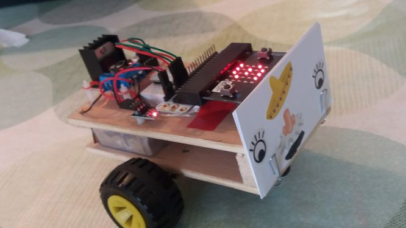

# *Bessie* the Bit Bot

Over the summer *Bessie*, previously controlled by a raspberry pi, has been rebuilt to work with a [Micro:bit](https://microbit.org)

## Make code
There is a simple set of functions for controlling *Bessie* in [this makecode project](https://makecode.microbit.org/_Rqtes73Du51s) 
You can use the following functions;

| Function | Purpose |
|-----------|--------------------|
| `forward` | Start *Bessie* moving forwards |
| `backward` | Start *Bessie* moving backwards |
| `stop` | Stop *Bessie* |
| `left` | Turn *Bessie* left |
| `right` | Turn *Bessie* right |

## Editor?

  <iframe style="position:absolute;top:0;left:0;width:100%;height:100%;" 
          src="https://makecode.microbit.org/#pub:_Rqtes73Du51s" frameborder="0" 
          sandbox="allow-popups allow-forms allow-scripts allow-same-origin">
  </iframe>

## Misc

[v1 version on makecode](https://makecode.microbit.org/_cH6LK00xp0cD). 
