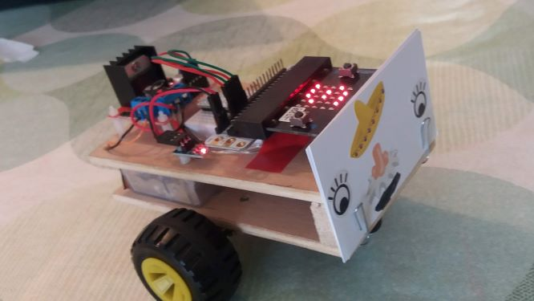

# *Bessie* the Bit Bot
*Matthew Mizielinski (a.k.a. Dr Miz), September 2018*

Over the summer *Bessie*, previously controlled by a raspberry pi, has been rebuilt to work with a [Micro:bit](https://microbit.org), and is now similar to [other micro:bit robots](https://coolcomponents.co.uk/products/move-mini-buggy-kit-excluding-microbit), but with plenty of capacity for expansion.

## Make a face?

Before you can load your code into *Bessie* you need to give her a face. Take a card (old business card size) and decorate it

## Make code
There is a simple set of functions for controlling *Bessie* in [this makecode project](https://makecode.microbit.org/_Rqtes73Du51s) 
You can use the following functions;

| Function   | LED letter | Purpose                             |
| ---        | ---        | ---                                 |
| `forward`  | F          | Start *Bessie* moving **forward**s  |
| `backward` | B          | Start *Bessie* moving **backward**s |
| `stop`     | S          | **Stop** *Bessie*                   |
| `left`     | L          | Turn *Bessie* **left**              |
| `right`    | R          | Turn *Bessie* **right**             |

In addition to these functions use the `pause` block to control how long each function is used for.

There are three combinations of buttons that you can use to get *Bessie* to run your code;
 * `A`: Initially runs a simple 6 second programme
 * `B`: Initially runs `stop`, to allow you to stop *Bessie* if your code has sent her out of control
 * `A + B`: Initially will just start *Bessie* moving forward
 
Use your imagination to come up with a sequence of moves for *Bessie* download the code into her Micro:bit and give it a try.

To control *Bessie* accurately you'll need to work out how long, i.e. how many milliseconds you need to pause, it takes to 

1. Turn 90&deg; 
2. Turn 180&deg; 
3. Move forward 10 cm
 
## Getting started

 1. In a new tab open **[this link](https://makecode.microbit.org/_Rqtes73Du51s)** (hold down Ctrl and click or use the right click menu).
 2. Click on one of the **Edit** buttons to load the full makecode pages.
 3. When you are ready **Download** your code as a *.hex* file, connect up to *Bessie* using the USB cable, and save it onto the `MICROBIT` drive.
 4. Disconnect *Bessie* and use the buttons to run your code
 
Try a few experiments to see if you can work out how to control *Bessie*. Once you are happy that you can create and run code have a think about the challenges below.

You may also find the following links helpful:
 * https://makecode.microbit.org/reference

## Challenges

1. Can you make *Bessie* dance round in a circle?
2. Can you make *Bessie* move in a
    * Triangle?
    * Square?
    * Hexagon?
    * Figure of eight?

## Future thoughts

 * Javascript option?
 * Python coding via https://microbit-micropython.readthedocs.io/en/latest/
 * Add a speaker?
 * Add Neopixels along edges?
 * Use of built in compass, accelerometer>
 * Interface with *Project C*?
 

## *Bessie* construction

*Bessie* is built from 
 * 2 [Motors](https://shop.4tronix.co.uk/collections/motors/products/n20-micro-metal-geared-motor-6v-various-speeds?variant=34222701121)
 * 1 [Dual H bridge](https://www.umtmedia.com/products/dual-h-bridge-l298n-stepper-motor-driver-controller-board-module-arduino-pi?variant=51500869844)
 * 1  LM1117T 3.3V voltage regulator (available on ebay and elsewhere). I've used a 3 pin board (see photo above, middle of side with a red LED)
 * 3 x 1.5 V battery pack (pinched from an old LED light string set)
 * 1 [Breadboard adapter for Micro:bit](https://coolcomponents.co.uk/collections/micro-bit/products/bbc-micro-bit-breadboard-adapter)
 * A cheap breadboard is used to seat the breadboard adapter on *Bessie*, but it isn't used (and isn't good at making connections anyway)
 * 2 x [Casters](https://shop.4tronix.co.uk/collections/motors/products/pololu-plastic-ball-caster-1-2)
 * 2 Wheels pinched from my old Mecano set
 * Plywood.
 
### Construction notes
  * I've used pins 13-16 to connect up the motor controller (H-bridge), using other was tricky as some of them are used by the LED display , see  https://makecode.microbit.org/device/pins.
  * Be **very** careful connecting up the power for the Micro:bit. Check the voltage and polarity before inserting the Micro:bit into the Breadboard adapter.
  
## Miscellaneous

[v1 of the project on makecode](https://makecode.microbit.org/_cH6LK00xp0cD) (not compatible with v0.14) 
